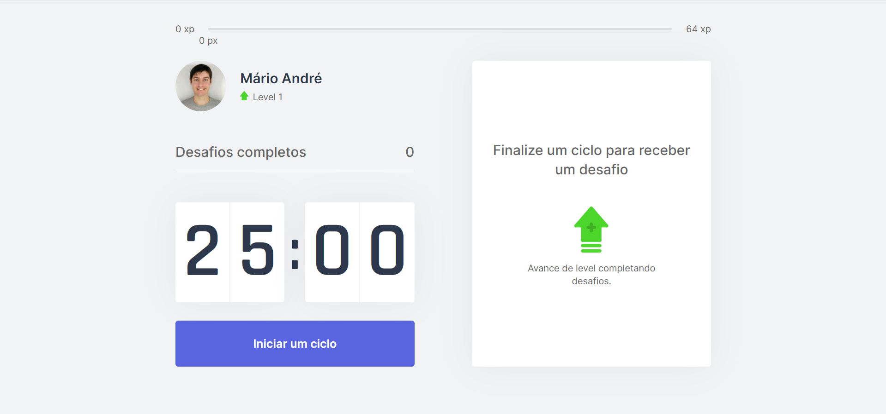
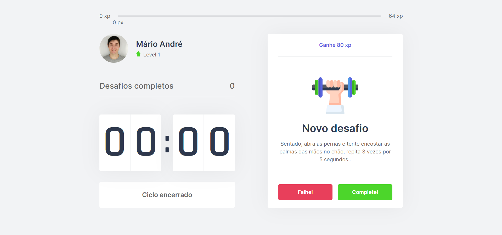

[](https://github.com/marioandre01)
[](#)
[](https://github.com/marioandre01/nlw-04-moveit_nextJS/stargazers)
[](https://github.com/marioandre01/nlw-04-moveit_nextJS/network/members)
[](https://github.com/marioandre01/nlw-04-moveit_nextJS/graphs/contributors)
[](https://github.com/marioandre01/nlw-04-moveit_nextJS/blob/master/LICENCE.md)


<h1 align="center">
  
  <br>
  nlw-04-moveit_nextJS
</h1>

<p align="center"> 
  <a href="#-projeto">Projeto</a>&nbsp;&nbsp;&nbsp;|&nbsp;&nbsp;&nbsp;
  <a href="#-tecnologias">Tecnologias</a>&nbsp;&nbsp;&nbsp;|&nbsp;&nbsp;&nbsp;
  <a href="#-layout">Layout</a>&nbsp;&nbsp;&nbsp;|&nbsp;&nbsp;&nbsp;
  <a href="#-executando-a-aplicação">Executando a aplicação</a>&nbsp;&nbsp;&nbsp;|&nbsp;&nbsp;&nbsp;
  <a href="#gear-contribuição">Contribuição</a>&nbsp;&nbsp;&nbsp;|&nbsp;&nbsp;&nbsp;
  <a href="#memo-licença">Licença</a>
</p>

## 💻 Projeto

Este projeto foi desenvolvido durante a [4º edição do evento Next Level Week - NLW-04](https://nextlevelweek.com/) da [Rocketseat](https://rocketseat.com.br/) na trilha de React que ocorreu entre os dias 22 a 28 de fevereiro. No qual foi ministrado pelo instrutor Diego Fernandes. Para essa imersão foi proposto fazer o **move.it**, que é uma aplicação que utiliza a técnica de Pomodoro para incentivar a realização de exercícios físicos para quem fica muito tempo na frente do computador. Nesse cenário o uso do app seria destinado mais para Devs.

A Técnica de Pomodoro é um método de gerenciamento de tempo criado por Francesco Cirillo no final dos anos 1980. A técnica consiste no uso de um cronômetro para dividir a tarefa a ser feita em períodos de 25 minutos, separados por pequenos intervalos, por exemplo de no mínimo 5 minutos ou mais se for necessário. Dessa forma o método se baseia na ideia de que pausas frequentes podem aumentar a agilidade mental, resultando em um melhor desempenho no que está sendo feito. O nome da técnica deriva da palavra italiana pomodoro (tomate), como referência ao popular cronômetro gastronômico na forma dessa fruta.


O resultado da aplicação pode ser acessado através da seguinte URL: [https://nlw-04-moveit-next-js.vercel.app/](https://nlw-04-moveit-next-js.vercel.app/)


## 📋 Tecnologias

O projeto foi desenvolvido com as seguintes tecnologias:

- [React](https://reactjs.org/)
- [Next.JS](https://nextjs.org/)
- [TypeScript](https://www.typescriptlang.org/)

## 🎨 Layout

### 💻 Web 

<p align="center">
  
  
</p>

<!-- ### 📱 Mobile  -->
<!-- <p align="center">
  
</p> -->

## 💻 Executando a aplicação

### :octocat: Clonando o Repositório

```bash
$ git clone https://github.com/marioandre01/nlw-04-moveit_nextJS.git

# entre na pasta do projeto
$ cd nlw-04-moveit_nextJS
```
### 💻 Executando a aplicação

Instale as dependências

```bash

# Com yarn
$ yarn

# ou pelo npm
$ npm install

```

Execute a aplicação (inicie o servidor)

```bash

# Com yarn
$ yarn dev

# ou pelo npm
$ npm run dev

```
Agora acesse **localhost:3000** no seu navegador.

## :gear: Contribuição

Para contribuir com esse projeto faça os seguintes passos:

- Faça um fork desse repositório;
- Crie uma branch com a sua feature: `git checkout -b minha-feature`;
- Faça commit das suas alterações: `git commit -m 'feat: Minha nova feature'`;
- Faça push para a sua branch: `git push origin minha-feature`.

## :memo: Licença

Esse projeto está sob a licença MIT. Veja o arquivo [LICENSE](./LICENSE) para mais detalhes.


